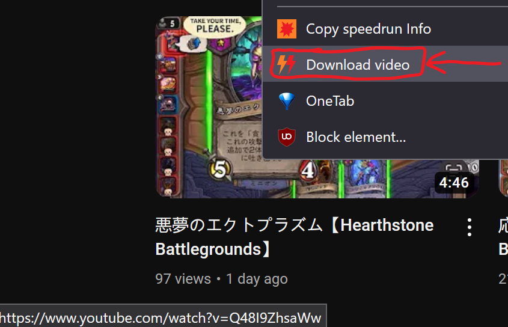
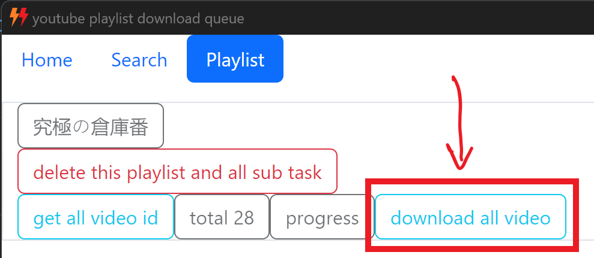

# what is this?

 - download youtube playlist.

 - download one youtube video.

 - download one youtube thumbnail.

---

# how to install?

### step1:

[download](./releases) windows portable app

youtube_playlist_download_queue-win32-x64-x.x.xx.zip

### step2:

install [firefox extension](https://addons.mozilla.org/zh-CN/firefox/addon/ytb-playlist-download-queue/)

---

# how to use?

 - step1: keep windows portable app running.

 - step2: keep firefox extension running.

 - step3: check windows portable app, if the time is ticking. you're success.

### download one video

click "download video"

### download playlist [unstable]

click it, waiting...

check the windows portable app "Playlist" area,

---

[MIT LICENSE](https://github.com/queue-download-youtube-playlist/queue-download-desktop/blob/main/LICENSE)

---

end